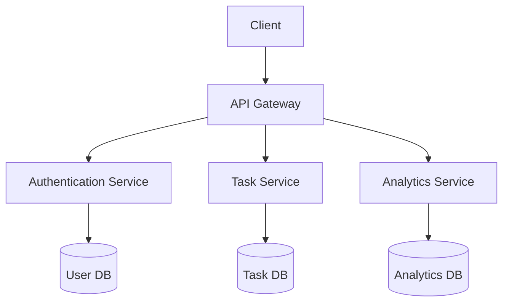
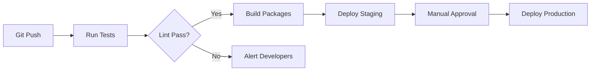

# 📚 GhedaTime Documentation

## 🌟 Introduction
- **Project Vision**: Redefining procrastination management through humor and productivity
- **Key Differentiators**: 
  - Procrastination-positive approach
  - Behavioral analytics with humor
  - Gamified task management

## 🛠️ System Architecture (Enhanced)



## 🔐 Security Deep Dive
**Authentication Flow**:
```sequence
Client->API: Login Request (email/password)
API->AuthService: Validate credentials
AuthService-->API: JWT Token
API-->Client: Return JWT
Client->API: Subsequent requests (with JWT)
API->AuthService: Verify JWT
AuthService-->API: User context
```

## 📊 Database Schema Details
**Task Model Relationships**:
```sql
CREATE TABLE tasks (
    id UUID PRIMARY KEY,
    user_id UUID REFERENCES users(id),
    title VARCHAR(255) NOT NULL,
    status ENUM('pending', 'completed', 'postponed'),
    due_date TIMESTAMP,
    postpone_count INT DEFAULT 0,
    created_at TIMESTAMP DEFAULT CURRENT_TIMESTAMP,
    updated_at TIMESTAMP DEFAULT CURRENT_TIMESTAMP
);
```

## 🚀 Deployment Strategies
**Multi-environment Setup**:
```yaml
# docker-compose.prod.yml
version: '3.8'

services:
  api:
    image: ghedatime-api:${VERSION}
    environment:
      - NODE_ENV=production
      - MONGO_URI=${PROD_MONGO_URI}
    ports:
      - "3000:3000"
  
  web:
    image: ghedatime-web:${VERSION}
    environment:
      - VITE_API_URL=${PROD_API_URL}
    ports:
      - "80:80"
```

## 📈 Analytics System
**Procrastination Score Algorithm**:
```python
def calculate_score(user):
    base = 100
    task_factor = 0.5 * len(user.incomplete_tasks)
    postpone_factor = 2 * sum(t.postpone_count for t in user.tasks)
    time_factor = 0.1 * (datetime.now() - user.created_at).days
    
    score = base - (task_factor + postpone_factor - time_factor)
    return max(min(score, 100), 0)
```

## 🔄 CI/CD Pipeline


## 📝 API Reference (OpenAPI 3.0 Excerpt)
```yaml
paths:
  /api/tasks/{id}/postpone:
    patch:
      summary: Postpone a task
      parameters:
        - name: id
          in: path
          required: true
          schema:
            type: string
      responses:
        '200':
          description: Task postponed
          content:
            application/json:
              schema:
                $ref: '#/components/schemas/Task'
        '401':
          description: Unauthorized
```

## 🧪 Testing Strategy
**Test Pyramid Composition**:
```
         UI Tests (10%)
          ↑
   Integration Tests (20%)
          ↑
Unit Tests (70%)
```

## 📦 Package Management
**Critical Dependencies**:
```json
{
  "dependencies": {
    "core-js": "^3.30.2",
    "react": "^18.3.1",
    "react-dom": "^18.3.1",
    "express": "^4.21.2",
    "mongoose": "^8.0.3",
    "jsonwebtoken": "^9.0.2"
  },
  "devDependencies": {
    "eslint": "^8.56.0",
    "jest": "^29.7.0",
    "cypress": "^13.6.2"
  }
}
```

## 🌐 Networking Configuration
**CORS Setup**:
```javascript
const corsOptions = {
  origin: process.env.NODE_ENV === 'production' 
    ? 'https://app.ghedatime.com'
    : 'http://localhost:5173',
  methods: ['GET', 'POST', 'PUT', 'DELETE'],
  allowedHeaders: ['Content-Type', 'Authorization'],
  maxAge: 86400
};
app.use(cors(corsOptions));
```
